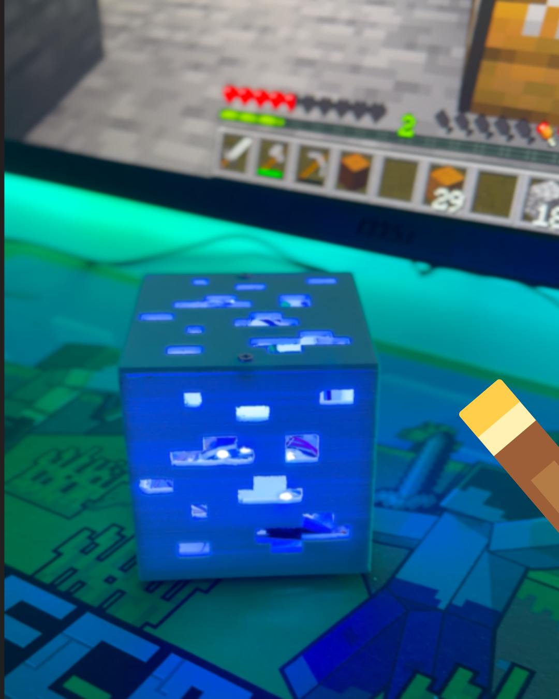
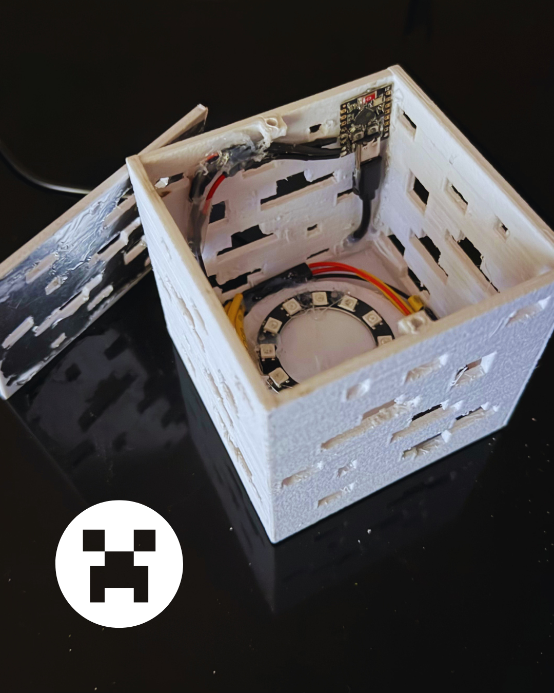

# 💎 Minecraft Diamond Block — ESP32 Smart Lamp

Ho ricreato il **Minecraft Diamond Block** con la stampante 3D e trasformato in una **lampada IoT** controllabile via **Wi‑Fi**.  
Il progetto utilizza un **ESP32 Mini**, un **LED Ring RGB** e una **Web App locale** per gestire colori, luminosità ed effetti direttamente dal browser.

---

## ✨ Caratteristiche

- 🖨️ **Struttura stampata in 3D**
- ⚡ **ESP32 Mini**
- 💡 **LED Ring RGB programmabile (NeoPixel)**
- 🌐 **Web App locale**
- 📱 **Controllo tramite Wi‑Fi**
- 🎨 **Color picker + luminosità**
- ✨ **Effetti luminosi**
- 💾 **Salvataggio impostazioni tramite LittleFS**

---

## 🛠️ Componenti

- ESP32 Mini  
- LED Ring RGB / NeoPixel  
- Struttura stampata in 3D  

---

## 🖨️ Stampa 3D

La struttura è progettata per diffondere la luce del LED Ring attraverso il PLA, creando un effetto luminoso uniforme e brillante.

---

## 🌐 Web App

L’ESP32 ospita una **Web App locale**, accessibile dalla rete Wi‑Fi domestica.

Dall’interfaccia puoi controllare:

- 🎨 Colore  
- 💡 Luminosità  
- ✨ Effetti LED  
- 🔧 Impostazioni della lampada  

Non serve alcuna app esterna: basta aprire l’indirizzo IP della lampada nel browser.

---

## 💾 LittleFS

Le impostazioni della lampada (colore, luminosità, effetto, stato ON/OFF) vengono salvate nella memoria flash dell’ESP32 tramite **LittleFS**, così rimangono memorizzate anche dopo il riavvio.

---

## 📁 Struttura del progetto:

MinecraftDiamondBlockLamp/

File3d/
    DiamondBlockTop.stl
    DiamondBlockCase.stl

src/
    MinecraftDiamondBlockLamp.ino

InterfacciaWeb/
    InterfacciaWeb.html

SchemaElettrico/
    SchemaElettrico.png

LICENSE

README.md

---

## 🚀 Installazione

1. Scarica o clona il repository  
2. Carica il firmware sull’ESP32 (`src/`)  
3. Carica la Web App nella memoria LittleFS (`InterfacciaWeb/`)  
4. Collega il LED Ring all’ESP32  
5. Alimenta il dispositivo  
6. Apri la Web App tramite browser (IP locale dell’ESP32)

---

## 🎥 Video

---

## 📸 Progetto

Da un semplice blocco di Minecraft a un piccolo progetto IoT completamente funzionante. 💎⚡  
Se lo ricrei, mi farebbe piacere vedere il tuo risultato!

---

## 📸 Foto

---

## 🔐 Licenza

Questo progetto è distribuito sotto licenza:

### **Creative Commons Attribution‑NonCommercial 4.0 International (CC BY‑NC 4.0)**  

Puoi:

- Condividere  
- Modificare  
- Creare progetti derivati  

Ma **non puoi usarlo per scopi commerciali**.

Testo completo della licenza:  
https://creativecommons.org/licenses/by-nc/4.0/

---

